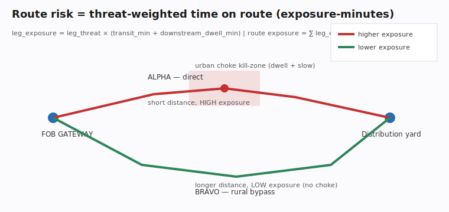

# Route-risk analysis & alternate-route comparison (`convoy-or-risk`)

> **UNCLASSIFIED // FOR PUBLIC RELEASE.** Decision support for a human route
> selection. This tool scores and ranks routes a planner already drew. It does
> **not** target, engage, cue, or task any asset, and it has no kill-chain
> function of any kind. All sample data is notional/synthetic for training and
> unit-testing.



*(Generated SVG diagram — no external assets, no third-party imagery.)*

---

## Why the base scan is not enough

`convoy-or` (the base command) answers a **binary** question about **one** plan:

> Does this route pass policy? (fuel range, max per-leg threat, escort, choke?)

That is the right gate for a CI check, but it is the wrong instrument for the
decision a route-selection officer actually makes, which is **comparative and
quantitative**:

> Of these N candidate routes, which exposes the convoy to the **least** risk,
> and **where** on the chosen route is that risk concentrated?

Two routes can pass — or fail — the same binary check and still differ by a wide
margin in real risk. `convoy-or-risk` is the decision-support layer that makes
that difference measurable.

---

## Threat model this addresses (frank and technical)

The dominant kinetic threat to a ground resupply convoy is not a fair fight in
the open. It is the **complex ambush / IED kill-zone**:

1. An adversary studies the convoy's likely routes (often the same main supply
   route, run at the same times, because logistics is repetitive).
2. They pre-position on a **segment where the convoy is forced to slow or stop**
   — a defile, a single-lane bridge, a built-up urban block, a checkpoint, a
   washed-out culvert. These are *choke points*.
3. The engagement window is a function of **how long the convoy is in that
   segment**: low speed and any dwell (a halt, a search, a hand-off) widen it.

The operational consequence is the core insight of this module:

> **Peak threat is a poor predictor of real risk. Threat-weighted *time* in the
> threat band is a good one.**

A route that touches a 0.8-threat segment for ninety seconds at speed is safer
than a route that sits in a 0.6-threat choke for twenty minutes. A pure
peak-threat policy check (`max_threat_per_leg`) is blind to that. This module is
not.

### What "defensive" means here, precisely

Everything this module produces is oriented toward **force protection and route
selection**:

- It tells you **which route is least dangerous** so you can pick it.
- It tells you **where the danger concentrates** so you can mitigate it (route
  recon, overwatch, QRF on standby, reduced dwell, varied timing, escort).
- It tells you **what policy you are about to violate** so a human can make a
  risk-acceptance decision.

It does not select targets, recommend engagement, generate fires, or task any
shooter. That boundary is deliberate and absolute.

---

## The exposure metric

For every leg of a route:

```
leg_threat   = max(threat_score of the two endpoint stops)      # core convention
transit_min  = (leg_distance_km / effective_speed) * 60
               where effective_speed = speed * 0.5 on a choke segment
leg_exposure = leg_threat * (transit_min + downstream_dwell_min)
```

The route's **exposure score** is the sum of leg exposures. It has natural units
of *threat-weighted minutes* ("exposure-minutes"). We also report:

| Output | Meaning |
|--------|---------|
| `exposure_score` | raw threat-weighted minutes (lower is better) |
| `risk_index` | exposure normalised to **0–100** for comparison (saturates at 100) |
| `band` | `low` / `elevated` / `high` / `severe` from the index |
| `peak_threat` | the single highest leg threat (kept for the policy view) |
| `choke_kill_zones` | segments matching the kill-zone signature (below) |
| `over_policy_legs` | legs exceeding `max_threat_per_leg` |
| `time_on_route_min` | transit + dwell (the force-protection clock) |
| `recommendations` | concrete, defensive mitigations |

### Kill-zone signature

A leg is flagged as a potential ambush/IED kill-zone when **all** of:

- it is a **choke** segment (either endpoint flagged `choke_point`), **and**
- the leg threat is **≥ 0.5**, **and**
- the convoy **dwells** there (`dwell_min > 0`) **or** the threat is **≥ 0.7**
  (a high-threat choke is a kill-zone even at speed, because the choke itself
  forces a slowdown).

This is intentionally conservative: it surfaces the textbook signature
(threat + forced slowdown + lingering) without crying wolf on every low-threat
chokepoint or every high-threat stretch of open road.

---

## Walkthrough: choosing between three real candidate routes

The shipped demo `demos/10-route-compare/` has three candidate routes between the
same two points, drawn by the planner:

| Route | Character |
|-------|-----------|
| `alpha-direct` | shortest MSR run, straight through an urban choke + bridge, full dwell |
| `bravo-bypass` | longer rural bypass, no urban choke, lower peak threat |
| `charlie-night` | identical geometry to ALPHA, but dwell minimised |

Run the comparison:

```bash
convoy-or-risk demos/10-route-compare/alpha-direct \
               demos/10-route-compare/bravo-bypass \
               demos/10-route-compare/charlie-night --format markdown
```

Result (abbreviated):

| Rank | Route | Risk index | Exposure | Time (min) | Dist (km) | Kill-zones |
|------|-------|-----------|----------|-----------|-----------|------------|
| 1 | `bravo-bypass` | 7.6 | 45.5 | 115.8 | 67.2 | 0 |
| 2 | `charlie-night` | 12.4 | 74.3 | 121.2 | 46.7 | 2 |
| 3 | `alpha-direct` | 14.8 | 89.0 | 144.2 | 46.7 | 2 |

Two results are worth reading carefully:

1. **`bravo-bypass` is recommended even though it is the *longest* route.** The
   extra distance buys you out of the urban choke kill-zone entirely. Its
   threat-weighted time on route is lowest. A distance-minimising planner would
   have picked the worst option.

2. **`charlie-night` beats `alpha-direct` on *identical geometry*.** The only
   difference between them is dwell time in the threat band. The exposure metric
   rewards minimising dwell where it matters — which is exactly the
   force-protection lesson you want the tool to teach.

### Acting on the brief

The ranking is **decision support, not an order.** The recommended workflow:

1. Confirm the threat overlay against **current** intelligence — the threat
   scores in a `plan.json` are an estimate, and a stale estimate is dangerous.
2. If the chosen route retains any flagged kill-zone, coordinate the mitigations
   the brief names (route recon, overwatch, QRF, dwell reduction, timing
   variation, escort).
3. For any **over-policy** leg, obtain a documented **risk-acceptance decision**
   from the approving authority before movement.
4. Feed the JSON into your downstream brief (`--format json --out brief.json`)
   or into the suite's mapping/SIEM path (see *Interop*, below).

---

## Single-route brief

With one target, you get a full risk profile and recommendations for that route:

```bash
convoy-or-risk demos/05-high-threat-corridor/
```

This is useful as a standalone route brief, and the `--speed` flag lets you model
how a slower planned pace (urban movement, night, degraded surface) inflates
exposure:

```bash
convoy-or-risk mission/ --speed 25      # slower pace -> more exposure-minutes
```

---

## Output formats

| `--format` | Use |
|------------|-----|
| `console` (default) | ASCII brief for a terminal / SSH / low-bandwidth link |
| `markdown` | drop into an OPORD annex, a wiki, or a PR |
| `json` | machine-readable; pipe to the next tool |

`--out FILE` writes to a file (and the file is UTF-8). The `console` renderer is
deliberately ASCII-only so it survives a cp1252 Windows terminal and a serial
console.

---

## Interop with the rest of the suite

The JSON comparison is a plain object and composes with the existing convoy-or
exits:

```bash
# Map the chosen route, then brief its risk:
convoy-or-map  demos/10-route-compare/bravo-bypass --out route.geojson
convoy-or-risk demos/10-route-compare/bravo-bypass --format json --out brief.json

# Forward base-scan findings to a platform (optional [connect] extra):
convoy-or demos/05-high-threat-corridor --format json | convoy-or-emit --to brief
```

See [`../INTEROP.md`](../INTEROP.md) and [`../INTEGRATIONS.md`](../INTEGRATIONS.md).

---

## Design notes & limits (candid)

- **Speed is a planning assumption, not telemetry.** Transit time is
  `distance / planned speed`, with choke segments at half speed. It is a
  defensible default, not a traffic simulation. Override with `--speed`.
- **Threat scores are operator/intel-supplied estimates.** The tool never
  fabricates them. Garbage in, garbage out — confirm against current intel.
- **The risk index ceiling (`RISK_INDEX_CEILING`) is a normalisation constant,
  not physics.** It is tuned so a permissive line-haul reads `low` and a long,
  high-threat, choke-laden route reads `severe`. Re-tune per theatre if your
  exposure ranges differ.
- **Great-circle distance** (haversine) is a floor on real road distance. For
  road-accurate distance, drive the legs from a routing engine and feed the
  resulting waypoints in as stops.
- **Deterministic and offline.** No network calls, no clock dependence in the
  math, identical output for identical input — which is what makes it testable
  and auditable.
